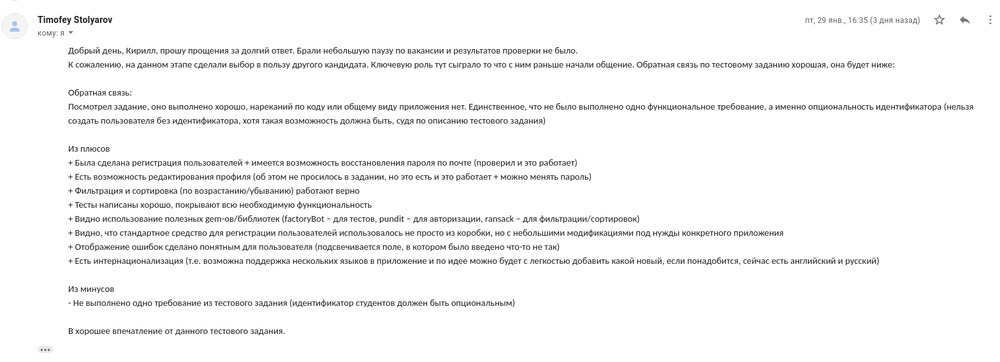

# Тестовое задание для компании [Velvetech Systems](https://www.velvetech.com/)

#### Разработать веб-приложение для управления студентами.

Приложение должно отвечать минимальным бизнес требованиям:
1. Возможность создать/отредактировать/удалить студента
2. Возможность просмотреть всех студентов с фильтрацией.
3. Возможность увидеть сколько всего заведено студентов.
4. Дополнительно, но не обязательно: в списке студентов добавить сортировку по убыванию или возрастанию
   полей (ФИО, Идентификатор и Пол).
5. Дополнительно, но не обязательно: авторизация и у каждого пользователя свой список студентов.

Поля студента:
* ID (required, PK). Можно использовать любой вариант. Это может быть как GUID, так и обычный
  int/long + increment. Это поле системное, изменение данного поля не допускается. Отображать в UI
  не обязательно.
* Пол (required).
* Фамилия (required, максимальная длина 40 символов).
* Имя (required, максимальная длина 40 символов).
* Отчество (not required, максимальная длина 60 символов).
* Уникальный идентификатор студента (not required, должен быть уникальным в рамках всех студентов,
  минимальная длина 6 символов, максимальная длина 16). Опциональный, например мы хотим задать для
  студента позывной, но не хотим чтобы два студента были с одинаковыми позывными.

Интерфейс должен включать следующие экраны:
* Список студентов.
* Должен содержать всех студентов (список).
* Должен иметь фильтры.
* Предоставляет возможность “Добавить студента”, “Редактировать студента”, “Удалить студента”.
* Редактирование студента должно открываться при нажатии на ФИО.

Создание/редактирование студента:
* предусмотреть клиентскую валидацию по условиям.

Backend:
* Ruby + RoR
* БД: на ваш выбор, например PostgreSQL

# Запуск приложения

Для того, чтобы запустить приложение, выполните следующие команды у себя в окне терминала:

* Склонируйте репозиторий с GitHub и перейдите в папку приложения:
 ```
 git clone https://github.com/cuurjol/velvetech_test.git
 cd velvetech_test
 ```

* Установите необходимые гемы приложения, указанные в файле `Gemfile`:
 ```
 bundle install
 ```

* Создайте базу данных, запустите миграции для базы данных и файл `seeds.rb` для создания записей в базу данных:
 ```
 bundle exec rake db:create
 bundle exec rake db:migrate
 bundle exec rake db:seed
 ```
Приложение использует СУБД `Postgressql`. При необходимости создайте нового пользователя в СУБД для этого приложения
или измените СУБД на другую, изменив настройки файла `config/database.yml`.

Приложение использует `gem devise` для аутентификации пользователей. Для того, чтобы корректно работала
инструкция по восстановлению пароля для пользователей, в проекте нужно создать файл 
`/config/local_env.yml` и добавить туда следующие строчки:

```
GMAIL_USERNAME: 'your-email@gmail.com'
GMAIL_PASSWORD: 'YOUR_PASSWORD'
```

**Важно:** я использую почту от Google и настройки этой почты находятся в файле 
`config/environments/development.rb`.

* Запустите приложение:
 ```
 bundle exec rails server
 ```

# Отзыв

К сожалению, я не смог попасть на техническое интервью, но один из сотрудников компании оставил мне 
отзыв о выполненном тестовом задании.

* Текст:
```
Добрый день, Кирилл, прошу прощения за долгий ответ. Брали небольшую паузу по вакансии и результатов проверки не было.
К сожалению, на данном этапе сделали выбор в пользу другого кандидата. Ключевую роль тут сыграло то что с ним раньше начали общение. Обратная связь по тестовому заданию хорошая, она будет ниже:

Обратная связь:
Посмотрел задание, оно выполнено хорошо, нареканий по коду или общему виду приложения нет. Единственное, что не было выполнено одно функциональное требование, а именно опциональность идентификатора (нельзя создать пользователя без идентификатора, хотя такая возможность должна быть, судя по описанию тестового задания)

Из плюсов
+ Была сделана регистрация пользователей + имеется возможность восстановления пароля по почте (проверил и это работает)
+ Есть возможность редактирования профиля (об этом не просилось в задании, но это есть и это работает + можно менять пароль)
+ Фильтрация и сортировка (по возрастанию/убыванию) работают верно
+ Тесты написаны хорошо, покрывают всю необходимую функциональность
+ Видно использование полезных gem-ов/библиотек (factoryBot – для тестов, pundit – для авторизации, ransack – для фильтрации/сортировок)
+ Видно, что стандартное средство для регистрации пользователей использовалось не просто из коробки, но с небольшими модификациями под нужды конкретного приложения
+ Отображение ошибок сделано понятным для пользователя (подсвечивается поле, в котором было введено что-то не так)
+ Есть интернационализация (т.е. возможна поддержка нескольких языков в приложение и по идее можно будет с легкостью добавить какой новый, если понадобится, сейчас есть английский и русский)

Из минусов
- Не выполнено одно требование из тестового задания (идентификатор студентов должен быть опциональным)

В хорошее впечатление от данного тестового задания.
```

* Скриншот:
